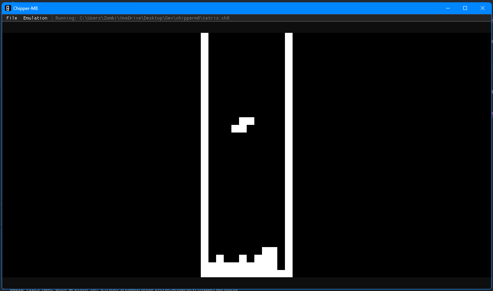

# Chipper M8

### _Chip-8 Emulator_

  

## What?
Chipper-M8 is a user-friendly [Chip-8](https://en.wikipedia.org/wiki/CHIP-8) "emulator". I wrote this as an exercise for emulator development. Additionally, some hobby chip-8 emulators are CLI launch only, so with this one I tried adding a friendly interface.

## Screenshot

_Chipper M-8 running a [Tetris](https://github.com/dmatlack/chip8/blob/master/roms/games/Tetris%20%5BFran%20Dachille%2C%201991%5D.ch8) clone by Fran Dachille, 1991_

## Chip-8?
Chip-8 is a "language"/"fantasy console" from the 1970's. It uses little memory and is designed to be architectually simple. There are no real "killer" titles, though it is very neat!

## Libraries
[SDL](https://www.libsdl.org/) and [Dear ImGui](https://github.com/ocornut/imgui) for graphics.  
[Native File Dialog](https://github.com/btzy/nativefiledialog-extended) for file dialog handling.

## Reference/Credit
The two biggest resources for this project were this [Wikipedia Article](https://en.wikipedia.org/wiki/CHIP-8) and this [Blog Post](https://austinmorlan.com/posts/chip8_emulator/) by Austin Morlan. Though I tried to do some things "my own way."